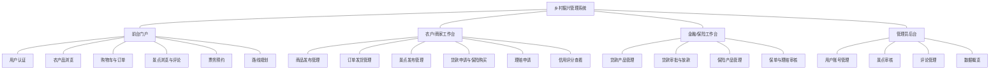

# 第三章 系统分析

## 3.1 可行性分析

系统可行性分析是系统开发前必要的论证环节，通过经济、技术、社会和操作四个维度的综合评估，判断乡村振兴管理系统建设的必要性与可实现性，为后续的需求分析与系统设计奠定基础。

### 3.1.1 经济可行性分析

从经济层面来看，本系统采用开源技术栈进行开发，后端基于 Spring Boot 3 与 Spring Security 6，前端基于 React 18 与 Vite，数据库选用 MySQL 8，缓存与会话层采用 JWT 无状态令牌，所有核心依赖均为免费且拥有活跃的开源社区，无需购买商业授权，显著降低了研发与运维成本。部署层面，系统既可部署于普通的 Linux 云服务器，也支持容器化部署，硬件门槛低。对于乡村产业主体而言，系统整合了农产品电商、旅游推广、票务预订、涉农贷款与农业保险等多项业务，农户与商家无需分别购买多个独立平台的服务，可直接通过统一入口面向全国消费者与金融机构，节省渠道费用与中介成本；对于金融服务商和保险提供商而言，系统将信用评分、贷款审批与保险理赔流程全部电子化，减少了线下驻村调研与纸质归档的成本。综上，本系统在投入产出比上具备明显的经济可行性。

### 3.1.2 技术可行性分析

从技术层面来看，本系统采用前后端分离架构，后端使用 Spring Boot 3.2 + Spring Data JPA + Spring Security + JWT 完成 RESTful API 开发，通过 Bean Validation 统一处理参数校验，通过 @ControllerAdvice 统一异常响应；数据库层面通过 JPA 实体（19 张业务表）与索引策略保证查询性能，并通过悲观行级锁（PESSIMISTIC_WRITE）解决票务与商品的超卖问题。前端采用 React + TypeScript + Ant Design 构建组件化界面，通过 Axios 拦截器统一处理 Token 与异常。系统还实现了本地图片缓存服务（LocalImageCacheService），解决了山区网络不稳定下的图片加载问题。以上技术均为业界主流并且团队成员在前期学习中已初步掌握，开发所需的文档、教程、示例代码丰富，因此在技术层面完全可行。

### 3.1.3 社会可行性分析

从社会层面来看，国家"十四五"规划明确提出要全面推进乡村振兴，加快农业农村现代化，数字乡村建设已成为战略重点。当前乡村振兴的主要瓶颈之一是信息不对称：农户生产的优质农产品难以对接城市消费者，乡村旅游资源缺乏统一的展示与预订渠道，中小农户的融资与风险保障渠道有限。本系统将电商、旅游、金融、保险四大板块整合于同一平台，并为六类角色（管理员、农户、商家、游客、金融服务商、保险提供商）提供差异化入口，符合当前政策导向与市场需求，具备广泛的社会接受度和推广价值。

### 3.1.4 操作可行性分析

从操作层面来看，系统界面采用 Ant Design 组件库，整体风格简洁、信息层级清晰，关键流程（如注册、登录、下单、预约、申请贷款、购买保险）均采用步骤式向导交互，输入表单配合实时校验提示，降低了用户的学习成本。对于文化程度参差不齐的农户群体，系统在关键字段处均提供占位符与中文说明；对于管理员，系统提供统一的后台入口，可对用户、景点、贷款申请、保险保单与理赔申请进行集中审核。系统在权限控制上通过 Spring Security 实现基于角色的访问控制（RBAC），越权访问会在服务端被拦截，保障了操作安全。综合来看，系统具备良好的操作可行性。

## 3.2 需求分析

### 3.2.1 用户需求

本系统的目标用户涵盖六类角色，其中核心服务对象为农户、商家、游客、金融服务商、保险提供商，并由管理员统一审核与监管。下面分别从三个主要侧面说明用户需求。

**（1）农户 / 商家用户**
农户与商家是平台上的生产端与经营端主体。他们希望通过平台发布自家的农产品（名称、价格、库存、产地、分类、多张详情图片等），管理订单（发货、查看销量、查看买家列表），发布乡村旅游景点（景点简介、封面、地址、开放时间、票型与房型设置），以及参与涉农金融服务（申请贷款、为种植/养殖风险购买保险、提交理赔申请）。他们还需要通过金融仪表盘查看本账号的信用评分与融资/保障情况。

**（2）游客 / 消费者**
游客是平台的消费端主体。他们希望能够便捷地浏览与搜索农产品并加入购物车、管理收货地址、下单并跟踪订单；希望能够浏览乡村景点详情、查看评价、收藏感兴趣的景点、预约门票或民宿（按天、按人、按房）、自行拼接"多景点 × 多日程"的个性化旅游路线；希望能够查看常见的贷款和保险产品作为参考，并在需要时申请贷款或购买保险。

**（3）管理员 / 金融服务商 / 保险提供商**
管理员负责平台整体秩序，需要对用户账号进行启用/禁用、对景点发布进行审核（通过/驳回并给出理由）、对评论进行隐藏、对农户经营数据进行核查。金融服务商（如银行、小贷公司）需要发布贷款产品、查看辖区内农户的信用评分与年经营收入，对贷款申请进行审批与放款。保险提供商需要发布保险产品（作物险、畜牧险、林业险、设施险、收入险等），审核保单购买与理赔申请。

### 3.2.2 功能需求

根据上述用户需求，将系统划分为 11 个功能模块：

1. **用户认证与权限管理模块** — 负责注册、登录、JWT 令牌签发与校验、个人资料维护、头像上传、基于角色的访问控制（RBAC）。
2. **农产品电商模块** — 负责商品类目管理、商品发布（含多张详情图）、商品上/下架、商品搜索与筛选、库存管理。
3. **购物车与订单模块** — 负责购物车增删改查、订单创建（事务 + 行级锁防超卖）、订单支付模拟、发货、完成、取消、订单号生成。
4. **地址簿模块** — 负责收货地址的增删改查、默认地址唯一性维护。
5. **旅游推广模块** — 负责景点发布、景点审核、景点搜索与详情浏览、景点评论与评分、景点收藏。
6. **票务预约模块** — 负责票型/房型配置、按日期查询余量、通过悲观锁扣减每日配额、预约码生成与核销。
7. **路线规划模块** — 负责用户自定义旅游路线、路线公开/复制、按天×序号组织景点项。
8. **贷款服务模块** — 负责贷款产品发布、农户提交贷款申请（携带信用评分与年营收快照）、金融服务商审批、放款与回款状态跟踪。
9. **保险服务模块** — 负责保险产品发布、保单购买、保单状态管理（待支付/生效/到期/已理赔/已取消）、理赔申请、理赔审核与赔付。
10. **财务分析与信用评分模块** — 负责根据订单、履约、信誉等多维度数据计算农户信用评分，输出金融仪表盘。
11. **管理员后台模块** — 负责用户管理、景点审核、评论管理、数据概览等平台级管理功能。

### 3.2.3 详细功能需求

#### （1）用户认证与权限管理模块
- **注册**：用户填写用户名、密码（BCrypt 加密存储）、昵称与角色，系统校验用户名唯一性后写入 user 表。金融服务商与保险提供商需额外填写机构名称（org_name）和经营许可编号（license_no）以备管理员审核。
- **登录**：基于用户名+密码校验通过后，由 JwtUtil 签发有效期 24 小时的 JWT，前端存入 localStorage，后续请求通过 `Authorization: Bearer <token>` 头携带。
- **权限控制**：通过 Spring Security 的 JwtAuthenticationFilter 在每个请求前解析 Token，并根据用户角色（ADMIN / FARMER / MERCHANT / TOURIST / FINANCIAL_PROVIDER / INSURANCE_PROVIDER）授予不同接口权限。
- **个人资料**：用户可修改昵称、手机号、邮箱，上传头像；头像通过 FileUploadController 保存到 uploads 目录，返回相对 URL。

#### （2）农产品电商模块
- **商品发布**：农户/商家录入商品名称、描述、价格、库存、计量单位（斤/箱/个）、产地、类目与标签，并上传主图以及多张详情图（ProductImage 表，支持 DETAIL/SPEC/ORIGIN 三种图片类型）。
- **商品浏览**：所有用户可按类目、关键词、产地进行筛选，系统按销量/上架时间排序返回分页结果。
- **商品详情**：支持完整的富文本描述、详情图轮播与本地缓存图片回退。
- **商品状态**：ON_SALE（在售）、OFF_SHELF（下架）、SOLD_OUT（售罄），由业务逻辑根据库存自动切换。

#### （3）购物车与订单模块
- **购物车**：CartItem 表通过 (userId, productId) 唯一约束实现"同一用户同一商品合并数量"，支持 selected 字段以便"勾选结算"。
- **订单创建**：下单时启用 @Transactional 事务，对目标 Product 使用 PESSIMISTIC_WRITE 行级锁扣减库存，避免并发超卖；同时生成订单号（yyyyMMddHHmmss+6 位随机数）、写入地址快照、计算总金额。
- **订单状态流转**：PENDING_PAYMENT → PAID → SHIPPED → COMPLETED，亦可在未发货时 CANCELLED。
- **订单快照**：OrderItem 冻结商品名称、图片、单价、单位，防止后续商品信息变更影响历史订单。

#### （4）地址簿模块
- **地址管理**：Address 表存储省/市/区/详情，并自动拼接 fullAddress。
- **默认地址**：每个用户只能有一个 isDefault=true 的地址，服务层在设置默认时会将同用户的其他地址置为 false。

#### （5）旅游推广模块
- **景点发布**：TourismSpot 包含 title、summary、content（富文本）、type（景区/农家乐/采摘园/农事体验/民俗文化）、封面图、多张图片 JSON、GPS 经纬度、门票价格、联系电话、营业时间等字段。
- **审核流程**：新发布景点状态为 PENDING，管理员通过 AdminTourismController 执行 APPROVED 或 REJECTED（需填写 rejectReason）。
- **评论与收藏**：TourismReview 通过 (userId, spotId) 唯一约束保证"一人一评"，评论包含 1-5 星评分与图片 JSON；TourismFavorite 同样唯一保证"一人一收藏"。
- **统计冗余**：TourismSpot 冗余存储 avgRating / reviewCount / favoriteCount / viewCount，评价/收藏变动时由服务层同步更新，避免每次查询都 JOIN 计算。

#### （6）票务预约模块
- **票型配置**：TicketType 支持 TICKET（按人按天）与 ROOM（按间按夜）两种模式，并设置 dailyCapacity（每日配额）、minQuantity/maxQuantity、advanceDays（提前预订天数）。
- **下单防超卖**：BookingService 在创建 TourismBooking 时，按 visitDate（或 checkIn..checkOut 区间内每一天）查询已确认预订数量，并使用悲观锁更新，确保在并发场景下同一天不会超出 dailyCapacity。
- **预约码**：生成 6 位字母数字 bookingCode，现场由商家核销（状态 CONFIRMED → USED）。

#### （7）路线规划模块
- **路线结构**：TourismRoute（总路线）+ TourismRouteItem（按 dayNumber + sortOrder 组织的单个景点项）。
- **协作**：路线可设为 isPublic=true 被其他用户浏览；系统记录 copyCount 用于推荐热门路线。

#### （8）贷款服务模块
- **产品**：LoanProduct 按 type（作物贷/农机贷/流动资金/土地贷/农业产业链贷）分类，包含最低/最高额度、年利率、期限、最低信用分、还款方式等。
- **申请**：农户提交 LoanApplication 时系统会将当时的 creditScoreSnapshot（信用评分）与 annualRevenueSnapshot（年营收）一并保存，防止后续经营变化影响历史申请审批依据。
- **审批**：状态流转为 SUBMITTED → UNDER_REVIEW → APPROVED/REJECTED → DISBURSED → REPAID，审批时可指定 approvedAmount 与 approvedRate。

#### （9）保险服务模块
- **产品**：InsuranceProduct 支持作物险/畜牧险/林业险/设施险/收入险五大类型，保费与保额均按单位（亩/头/份）设置。
- **保单**：InsurancePolicy 生成唯一 policyNo，保存 quantity × premium 为 totalPremium、quantity × coverageAmount 为 totalCoverage，状态为 PENDING_PAYMENT / ACTIVE / EXPIRED / CLAIMED / CANCELLED。
- **理赔**：InsuranceClaim 支持上传事故描述与图片证据，保险提供商审核后给出 assessedAmount 与 payoutAmount。

#### （10）财务分析与信用评分模块
- **信用评分**：FinancialController 根据农户的历史订单数、累计销售额、按时发货率、评价均分、历史贷款按时还款率等多维度加权计算，输出 0–1000 的信用分数。
- **金融仪表盘**：输出累计贷款金额、累计赔付金额、有效保单数、当前信用等级等指标，供农户自查与金融机构参考。

#### （11）管理员后台模块
- **用户管理**：AdminUserController 支持列表分页、启用/禁用、重置密码。
- **景点审核**：AdminTourismController 支持景点审核通过/驳回、下架、隐藏违规评论。

## 3.3 系统结构分析

乡村振兴管理系统在功能结构上采用"角色 × 模块"的矩阵式划分，六类角色通过统一的权限网关访问各自允许的模块，所有业务模块共享底层的用户、商品、订单、景点、贷款、保险六大实体域。整体功能架构如下图所示：

## 3.4 设计思想

本系统在设计过程中遵循以下核心思想：

**（1）分层架构与职责分离**  
后端采用经典的 Controller → Service → Repository 三层架构，Controller 仅负责参数校验与响应封装，Service 承载业务逻辑，Repository 基于 Spring Data JPA 完成持久化。所有响应统一通过 Result\<T\> 封装 code、message、data 三字段，异常通过 @ControllerAdvice 的 GlobalExceptionHandler 集中处理。

**（2）前后端分离与无状态会话**  
前端基于 React + Vite 独立部署，后端仅输出 RESTful JSON 接口，通过 JWT 实现无状态会话。这种架构使得未来可以方便地接入移动端或小程序端。

**（3）安全优先**  
密码使用 BCrypt 加盐哈希，避免明文存储；接口访问通过 Spring Security 的方法级注解或 URL 级规则进行 RBAC 授权；文件上传限制了大小（5MB）与类型；关键业务操作（下单、预约）使用数据库行级锁防止并发问题。

**（4）数据快照与历史可追溯**  
订单、预订、贷款申请、保单等交易类实体均保存业务发生时的关键字段快照（如商品名称、价格、信用评分、年营收），防止主数据变更对历史记录产生追溯性影响。

**（5）冗余计数换性能**  
景点、商品等热点实体冗余存储 viewCount / salesCount / avgRating / favoriteCount 等统计字段，在写操作时由服务层同步更新，避免列表页反复 JOIN 聚合查询。

**（6）弱网友好**  
针对乡村网络不稳定的场景，系统实现了本地图片缓存服务 LocalImageCacheService，农户可将本地图片先落地到 local-cache 目录再发布商品/景点，并支持缓存列表与清理。

## 3.5 预期成果

系统开发完成后，预期达成以下成果：

1. 构建一套前后端分离、角色完备的乡村振兴综合服务平台，涵盖电商、旅游、金融、保险四大业务板块；
2. 面向农户/商家：实现商品一站式发布销售、订单全流程管理、景点发布与票务预订、贷款与保险申请；
3. 面向游客：实现从搜索浏览、评价收藏、门票/民宿预约到多日路线规划的完整乡村旅游闭环；
4. 面向金融服务商与保险提供商：提供电子化的产品发布、在线审批与线上理赔能力，辅以信用评分辅助决策；
5. 面向管理员：提供用户、景点、评论的集中审核与治理能力；
6. 系统整体满足 200+ 并发用户的访问性能，关键写操作通过行级锁保证数据一致性，可作为乡村振兴数字化建设的样板工程。
