# 第四章 系统设计

## 4.1 功能模块设计

在第三章需求分析的基础上，本系统将整体功能按照"业务域"进行划分，共分解为 11 个功能模块。每个模块内部再细分为若干子功能，各模块之间通过统一的用户身份体系、订单体系和 REST API 进行交互。系统整体功能模块划分如下：

```mermaid
graph TD
    SYS[乡村振兴管理系统]

    SYS --> U[1. 用户认证与权限管理]
    SYS --> P[2. 农产品电商]
    SYS --> C[3. 购物车与订单]
    SYS --> AD[4. 地址簿]
    SYS --> T[5. 旅游推广]
    SYS --> B[6. 票务预约]
    SYS --> R[7. 路线规划]
    SYS --> L[8. 贷款服务]
    SYS --> I[9. 保险服务]
    SYS --> F[10. 财务分析与信用评分]
    SYS --> A[11. 管理员后台]

    U --> U1[注册]
    U --> U2[登录]
    U --> U3[个人资料]
    U --> U4[头像上传]
    U --> U5[权限校验]

    P --> P1[类目管理]
    P --> P2[商品发布]
    P --> P3[详情图管理]
    P --> P4[商品搜索]
    P --> P5[上下架]

    C --> C1[购物车增删改]
    C --> C2[结算下单]
    C --> C3[订单跟踪]
    C --> C4[发货/完成/取消]

    AD --> AD1[地址增删改]
    AD --> AD2[默认地址]

    T --> T1[景点发布]
    T --> T2[景点审核]
    T --> T3[评论评分]
    T --> T4[收藏]

    B --> B1[票型房型配置]
    B --> B2[余量查询]
    B --> B3[下单锁定配额]
    B --> B4[预约码核销]

    R --> R1[路线创建]
    R --> R2[路线项编排]
    R --> R3[路线公开/复制]

    L --> L1[贷款产品发布]
    L --> L2[贷款申请]
    L --> L3[贷款审批]
    L --> L4[放款/回款]

    I --> I1[保险产品发布]
    I --> I2[保单购买]
    I --> I3[理赔申请]
    I --> I4[理赔审核]

    F --> F1[信用评分计算]
    F --> F2[金融仪表盘]

    A --> A1[用户管理]
    A --> A2[景点审核]
    A --> A3[评论管理]
```

## 4.2 功能流程设计

### 4.2.1 登录流程

用户访问系统时，若未携带有效 Token 或 Token 已过期，会被前端路由守卫引导至登录页。登录流程完整描述如下：

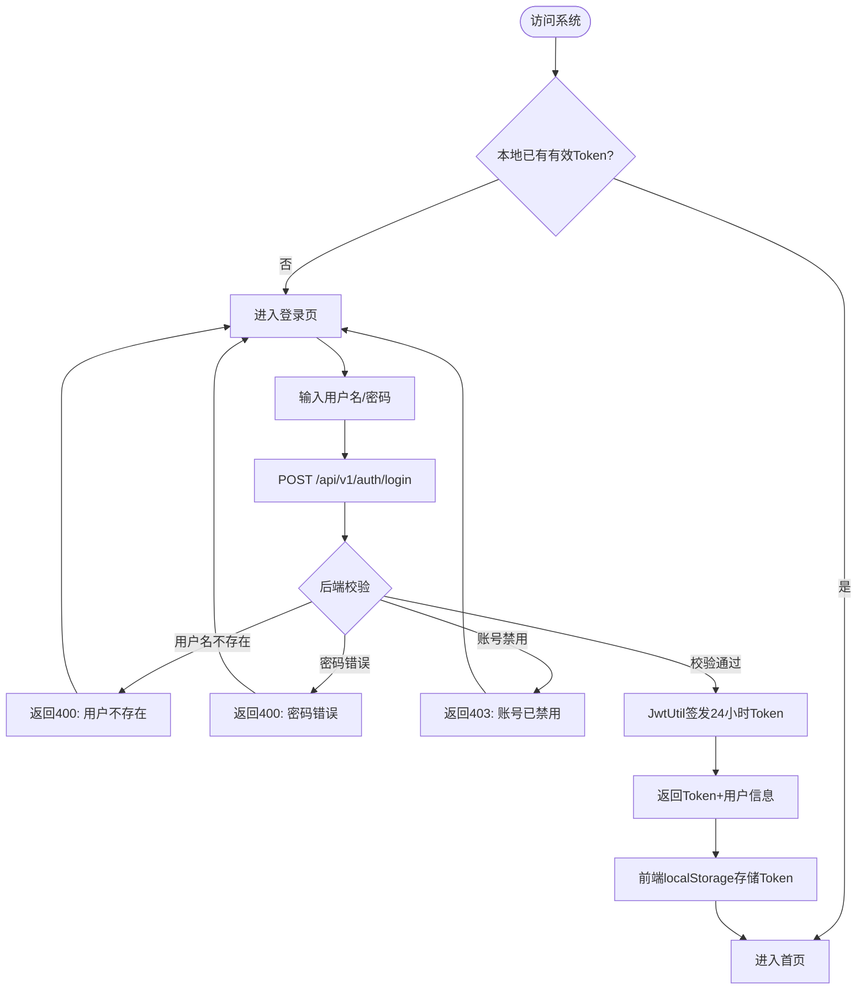

### 4.2.2 注册流程

注册流程支持六类角色的差异化字段校验，流程如下：

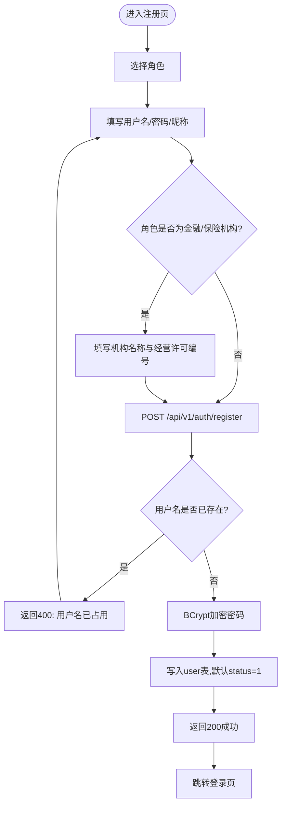

### 4.2.3 添加流程（以商品发布为例）

系统内的"添加"操作统一遵循"鉴权 → 校验 → 落库 → 返回"流程，以最具代表性的商品发布为例：

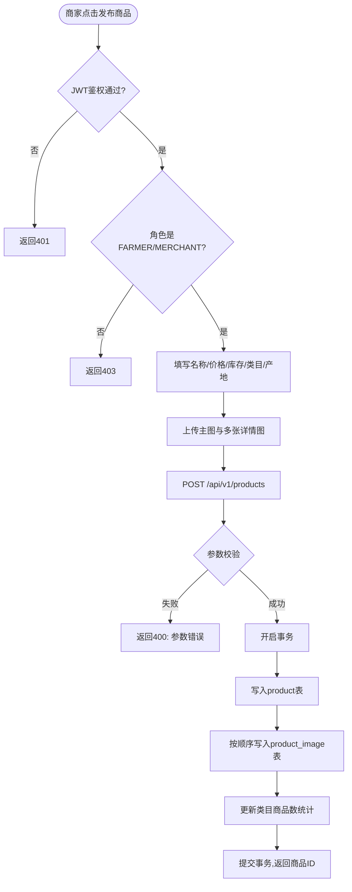

### 4.2.4 修改流程（以景点审核为例）

修改类操作通常伴随状态流转与权限校验，以管理员审核景点为例：

```mermaid
flowchart TD
    START([管理员进入待审核列表]) --> SELECT[选择景点]
    SELECT --> ACT{审核决策}
    ACT -- 通过 --> OK[PUT /spots/{id}/audit status=APPROVED]
    ACT -- 驳回 --> REJ[填写rejectReason]
    REJ --> NO[PUT /spots/{id}/audit status=REJECTED]
    OK --> CHK{状态机校验:是否为PENDING?}
    NO --> CHK
    CHK -- 否 --> ERR[返回400: 状态不允许]
    CHK -- 是 --> UPDATE[更新tourism_spot.status]
    UPDATE --> NOTIFY[记录审核人与时间]
    NOTIFY --> DONE([返回成功])
```

### 4.2.5 删除流程（以订单取消为例）

系统对交易类数据采用"状态位软取消"而非物理删除，以订单取消为例：

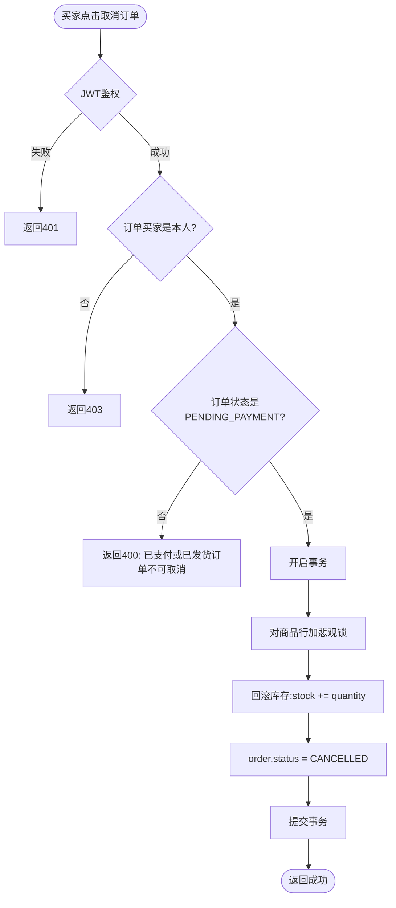

## 4.3 数据库设计

### 4.3.1 用户 E-R 图

用户实体是系统的核心身份载体，承担六类角色的统一登录与权限判定，同时为金融/保险机构保留了机构名称与经营许可编号。用户的 E-R 图如下：

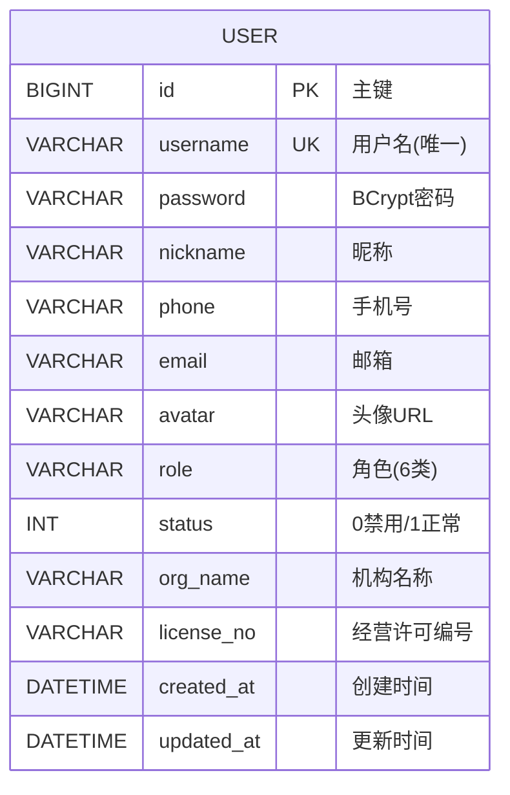

### 4.3.2 商家（景点发布/金融机构）E-R 图

本系统中的"商家"概念由 User 表通过 role 字段区分承担，其中 MERCHANT/FARMER 发布景点与商品，FINANCIAL_PROVIDER/INSURANCE_PROVIDER 发布金融与保险产品。以景点发布主体为例，其 E-R 关系如下：

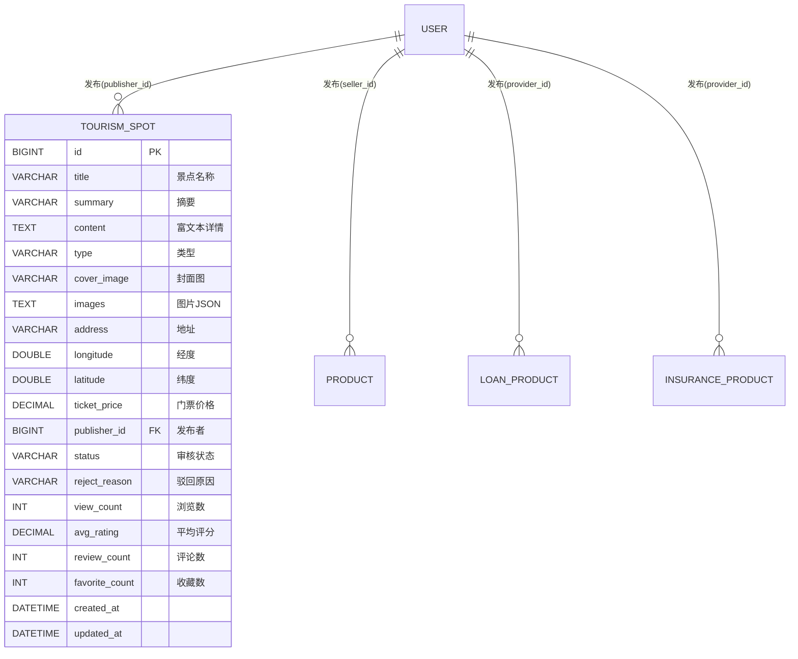

### 4.3.3 管理员 E-R 图

管理员同样复用 User 表（role=ADMIN），其核心行为是对其他实体的状态字段进行审核，形成"管理员 × 被管理实体"的弱关联。其 E-R 关系如下：

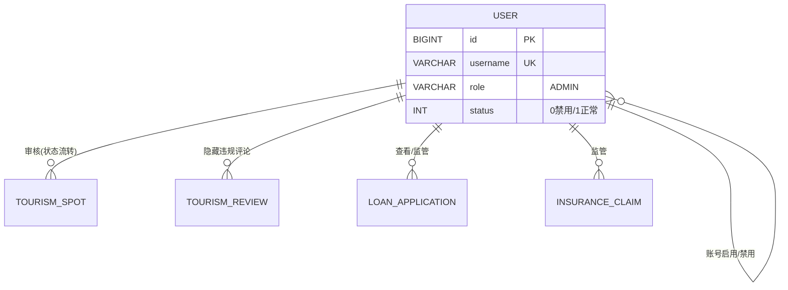

### 4.3.4 农产品 E-R 图

农产品模块以 Product 为核心，挂接类目、详情图、库存、销量等，E-R 关系如下：

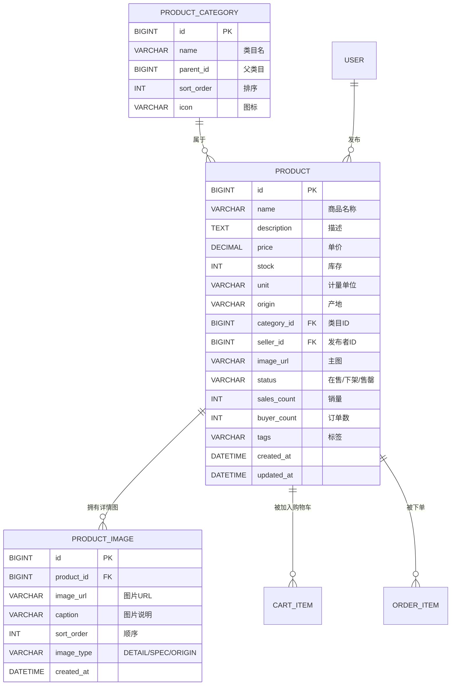

### 4.3.5 订单 E-R 图

订单模块以 Order 为聚合根，包含 OrderItem 子项、并挂接地址快照：

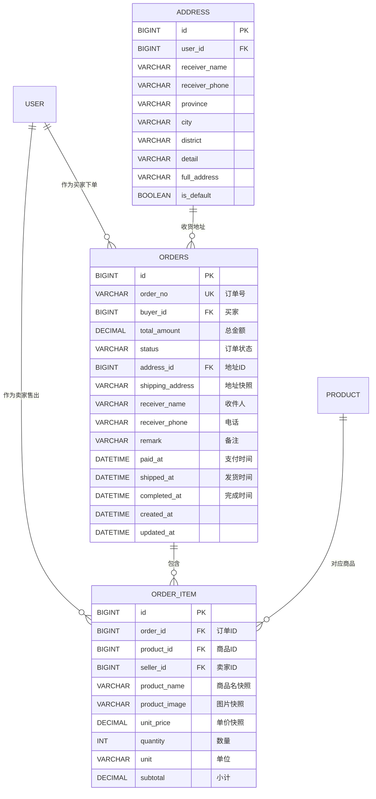

### 4.3.6 系统总体 E-R 图

将前述各业务域整合后，系统总体 E-R 图如下。为保持清晰，仅展示核心实体及其主要关联：

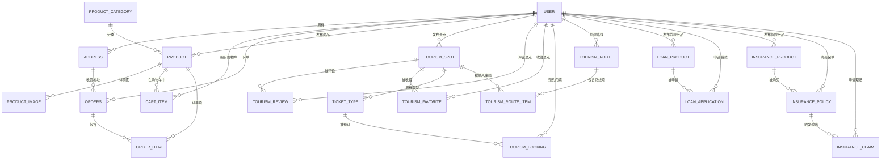

### 4.3.2 数据库表设计

根据以上 E-R 图，将系统数据持久化为 19 张物理表。下面列出其中 7 张最核心的表的详细字段设计。

**表 4-1 用户表（user）**

| 字段名 | 类型 | 约束 | 说明 |
| :-- | :-- | :-- | :-- |
| id | BIGINT | PK, AUTO_INCREMENT | 主键 |
| username | VARCHAR(50) | NOT NULL, UNIQUE | 用户名 |
| password | VARCHAR(255) | NOT NULL | BCrypt 加密密码 |
| nickname | VARCHAR(50) | NULL | 昵称 |
| phone | VARCHAR(20) | NULL | 手机号 |
| email | VARCHAR(100) | NULL | 邮箱 |
| avatar | VARCHAR(255) | NULL | 头像 URL |
| role | VARCHAR(30) | NOT NULL, DEFAULT 'TOURIST' | 角色枚举 |
| status | INT | NOT NULL, DEFAULT 1 | 0 禁用 / 1 正常 |
| org_name | VARCHAR(200) | NULL | 机构名称 |
| license_no | VARCHAR(100) | NULL | 经营许可编号 |
| created_at | DATETIME | NULL | 创建时间 |
| updated_at | DATETIME | NULL | 更新时间 |

**表 4-2 商品表（product）**

| 字段名 | 类型 | 约束 | 说明 |
| :-- | :-- | :-- | :-- |
| id | BIGINT | PK, AUTO_INCREMENT | 主键 |
| name | VARCHAR(100) | NOT NULL | 商品名 |
| description | TEXT | NULL | 富文本描述 |
| price | DECIMAL(10,2) | NOT NULL | 单价 |
| stock | INT | DEFAULT 0 | 库存 |
| unit | VARCHAR(20) | NULL | 计量单位 |
| origin | VARCHAR(100) | NULL | 产地 |
| category_id | BIGINT | NULL, FK | 类目 ID |
| seller_id | BIGINT | NOT NULL, FK | 发布者 ID |
| image_url | VARCHAR(500) | NULL | 主图 URL |
| status | VARCHAR(20) | NOT NULL | ON_SALE/OFF_SHELF/SOLD_OUT |
| sales_count | INT | DEFAULT 0 | 销量 |
| buyer_count | INT | DEFAULT 0 | 订单数 |
| tags | VARCHAR(500) | NULL | 标签 |
| created_at | DATETIME | NULL | 创建时间 |
| updated_at | DATETIME | NULL | 更新时间 |

**表 4-3 商品详情图表（product_image）**

| 字段名 | 类型 | 约束 | 说明 |
| :-- | :-- | :-- | :-- |
| id | BIGINT | PK | 主键 |
| product_id | BIGINT | NOT NULL, FK | 商品 ID |
| image_url | VARCHAR(500) | NOT NULL | 图片 URL |
| caption | VARCHAR(200) | NULL | 图片说明 |
| sort_order | INT | DEFAULT 0 | 排序 |
| image_type | VARCHAR(20) | NULL | DETAIL/SPEC/ORIGIN |
| created_at | DATETIME | NULL | 创建时间 |

**表 4-4 订单表（orders）**

| 字段名 | 类型 | 约束 | 说明 |
| :-- | :-- | :-- | :-- |
| id | BIGINT | PK | 主键 |
| order_no | VARCHAR(32) | NOT NULL, UNIQUE | 订单号 |
| buyer_id | BIGINT | NOT NULL, FK | 买家 ID |
| total_amount | DECIMAL(12,2) | NOT NULL | 总金额 |
| status | VARCHAR(20) | NOT NULL | 订单状态 |
| address_id | BIGINT | NULL, FK | 地址 ID |
| shipping_address | VARCHAR(500) | NULL | 地址快照 |
| receiver_name | VARCHAR(50) | NULL | 收件人 |
| receiver_phone | VARCHAR(20) | NULL | 收件电话 |
| remark | VARCHAR(500) | NULL | 备注 |
| paid_at | DATETIME | NULL | 支付时间 |
| shipped_at | DATETIME | NULL | 发货时间 |
| completed_at | DATETIME | NULL | 完成时间 |
| created_at | DATETIME | NULL | 创建时间 |
| updated_at | DATETIME | NULL | 更新时间 |

**表 4-5 景点表（tourism_spot）**

| 字段名 | 类型 | 约束 | 说明 |
| :-- | :-- | :-- | :-- |
| id | BIGINT | PK | 主键 |
| title | VARCHAR(200) | NOT NULL | 景点名 |
| summary | VARCHAR(500) | NULL | 摘要 |
| content | TEXT | NULL | 富文本详情 |
| type | VARCHAR(30) | NOT NULL | 景点类型 |
| cover_image | VARCHAR(500) | NULL | 封面图 |
| images | TEXT | NULL | 图片 JSON |
| address | VARCHAR(300) | NULL | 地址 |
| longitude | DOUBLE | NULL | 经度 |
| latitude | DOUBLE | NULL | 纬度 |
| contact_phone | VARCHAR(30) | NULL | 联系电话 |
| opening_hours | VARCHAR(100) | NULL | 营业时间 |
| ticket_price | DECIMAL(10,2) | DEFAULT 0 | 门票价 |
| publisher_id | BIGINT | NOT NULL, FK | 发布者 |
| status | VARCHAR(20) | NOT NULL | 审核状态 |
| reject_reason | VARCHAR(500) | NULL | 驳回原因 |
| view_count | INT | DEFAULT 0 | 浏览量 |
| avg_rating | DECIMAL(3,1) | DEFAULT 0 | 平均评分 |
| review_count | INT | DEFAULT 0 | 评论数 |
| favorite_count | INT | DEFAULT 0 | 收藏数 |
| tags | VARCHAR(500) | NULL | 标签 |
| created_at | DATETIME | NULL | 创建时间 |
| updated_at | DATETIME | NULL | 更新时间 |

**表 4-6 贷款申请表（loan_application）**

| 字段名 | 类型 | 约束 | 说明 |
| :-- | :-- | :-- | :-- |
| id | BIGINT | PK | 主键 |
| applicant_id | BIGINT | NOT NULL, FK | 申请人 ID |
| product_id | BIGINT | NOT NULL, FK | 贷款产品 ID |
| provider_id | BIGINT | NOT NULL, FK | 金融机构 ID |
| apply_amount | DECIMAL(14,2) | NOT NULL | 申请金额 |
| apply_term_months | INT | NOT NULL | 申请期限 |
| purpose | VARCHAR(1000) | NOT NULL | 用途说明 |
| credit_score_snapshot | INT | NULL | 信用分快照 |
| annual_revenue_snapshot | DECIMAL(14,2) | NULL | 年营收快照 |
| status | VARCHAR(20) | NOT NULL | 申请状态 |
| review_comment | VARCHAR(500) | NULL | 审核意见 |
| approved_amount | DECIMAL(14,2) | NULL | 批准金额 |
| approved_rate | DECIMAL(5,2) | NULL | 批准年利率 |
| reviewer_id | BIGINT | NULL | 审核人 ID |
| reviewed_at | DATETIME | NULL | 审核时间 |
| disbursed_at | DATETIME | NULL | 放款时间 |
| created_at | DATETIME | NULL | 创建时间 |
| updated_at | DATETIME | NULL | 更新时间 |

**表 4-7 保单表（insurance_policy）**

| 字段名 | 类型 | 约束 | 说明 |
| :-- | :-- | :-- | :-- |
| id | BIGINT | PK | 主键 |
| policy_no | VARCHAR(30) | NOT NULL, UNIQUE | 保单号 |
| holder_id | BIGINT | NOT NULL, FK | 投保人 |
| product_id | BIGINT | NOT NULL, FK | 保险产品 ID |
| provider_id | BIGINT | NOT NULL, FK | 保险公司 |
| product_name | VARCHAR(100) | NOT NULL | 产品名快照 |
| quantity | INT | NOT NULL | 投保数量（亩/头/份） |
| quantity_unit | VARCHAR(20) | NULL | 数量单位 |
| total_premium | DECIMAL(12,2) | NOT NULL | 总保费 |
| total_coverage | DECIMAL(14,2) | NOT NULL | 总保额 |
| effective_date | DATE | NOT NULL | 生效日期 |
| expiry_date | DATE | NOT NULL | 到期日期 |
| status | VARCHAR(20) | NOT NULL | 保单状态 |
| paid_at | DATETIME | NULL | 缴费时间 |
| created_at | DATETIME | NULL | 创建时间 |
| updated_at | DATETIME | NULL | 更新时间 |

除以上 7 张核心表外，系统还包含 cart_item、address、order_item、product_category、tourism_review、tourism_favorite、tourism_ticket、tourism_booking、tourism_route、tourism_route_item、loan_product、insurance_product、insurance_claim 共 12 张辅助与扩展表，总计 19 张表，可完整支撑 11 个功能模块的全部业务场景。
